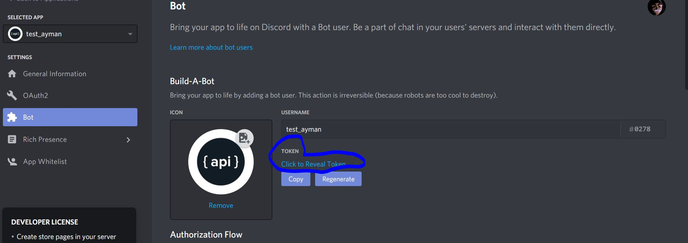

= Discord Bot
Ayman Patel
:toc:


== Getting Started

 
=== 1. Installing `discord.py` (Name of Discord library)


```
pip install -U discord.py
```

`discord.py` is a Python library that exhaustively implements Discord’s APIs in an efficient and Pythonic way. This includes utilizing Python’s implementation of **Async IO**.


=== 2. Add token


```
from dotenv import load_dotenv
load_dotenv()
DISCORD_TOKEN = os.getenv('DISCORD_TOKEN')
```

`.env`:

`DISCORD_TOKEN=<discord-token>`




> `pip install -r requirements.txt` after setting up virtual environment


== Links


- https://discordpy.readthedocs.io/en/latest/api.html[Discord API]
- https://discord.com/developers/docs/intro[Discord Development Portal]
- https://www.writebots.com/discord-bot-hosting[Hosting your bot]
